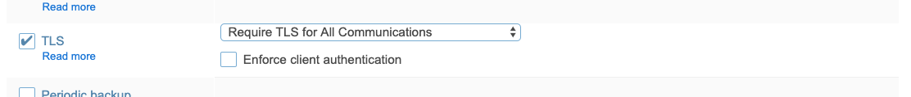
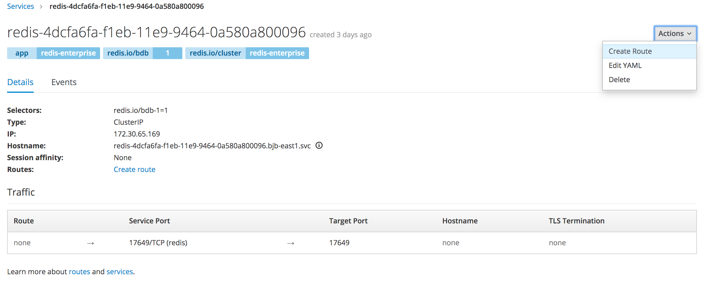
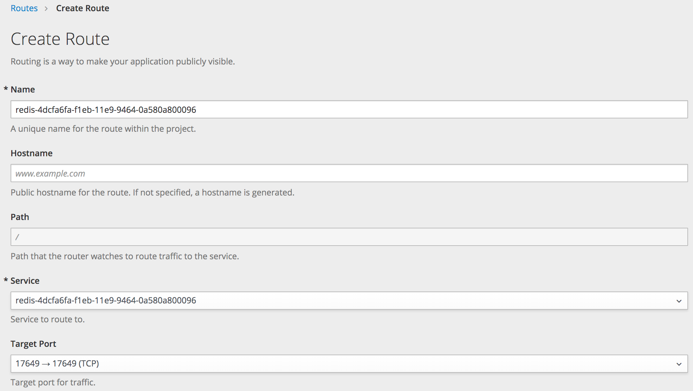
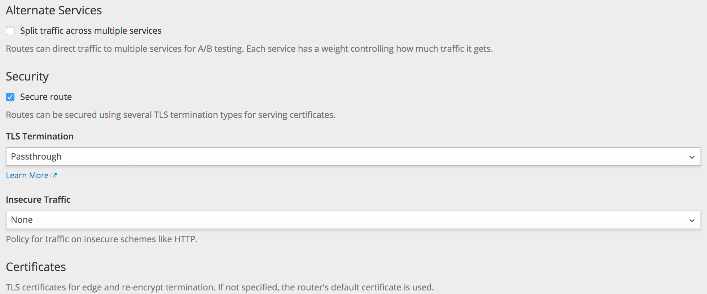
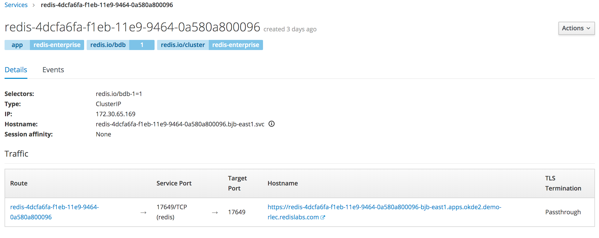

# How to expose a Redis Enterprise database for use outside of Openshift K8s

Thanks to Virag for documenting this.

We are going to use One-Way SSL and the self-signed cert from the default Redis Enterprise installation for this example. 

## Prerequisites

The following are needed:
  * A Redis Enterprise database with one-way SSL configured. 
  * Proxy certificate from the deployed Redis Enteprise Cluster

To configure a redis DB with One-way SSL, configure your redis DB using the web UI with the following TLS settings:


<!--
Please follow [One-Way SSL](https://redislabs.atlassian.net/wiki/spaces/SA/pages/658080277/TLS+SSL+on+Redis+Enterprise?atlOrigin=eyJpIjoiYTJkY2IxYTU1ZjdlNDE0Yzg0YzVhNjZiNThhYTA0MWEiLCJwIjoiYyJ9) **Server Configuration** and **Server Cert** to pass the cert and/or keystore to the clients below.
-->


You should have a proxy cert (`proxy_cert.pem` from one of the redis-enterprise pod or from the REST API) and a java keystore ready for the clients to work. Obtain the `proxy_cert.pem` from Redis Enterprise from via REST API as follows:
```
$ curl -u <usename>:<password> https://<cluster_address>:9443/v1/cluster/certificates | jq '.proxy_cert'
"-----BEGIN CERTIFICATE-----\n
...
-----END CERTIFICATE-----\n"
$
```


Create an Openshift TLS Route: Follow the steps to create a [route](https://docs.openshift.com/container-platform/3.11/architecture/networking/routes.html#secured-routes) on a database service for external access using [SNI](https://en.wikipedia.org/wiki/Server_Name_Indication) enabled clients. 
    
1. Locate the Redis DB service you want to expose.
   
*note:* There are two services per DB. One is the headless service `<db_name>-headless` and the other is `<db_name>`. Please chose the services `<db_name>` to be exposed. 



2.  Choose Defaults names.
    



3. Check the secure route and TLS Termination should be on passthrough.



4. Copy the Route’s Hostname.




## Code examples for testing

Build and connect using SNI enabled clients: We will be using the Route’s Hostname and port 443 (OS uses HAProxy for the route and it always connects on port 443 for HTTPS by default) to connect to Redis Enterprise database(s) from outside with [SNI](https://en.wikipedia.org/wiki/Server_Name_Indication) enabled clients like Java and Python.
    

### Jedis Example #1

Maven Dependency
```
    <dependency>
      <groupId>redis.clients</groupId>
      <artifactId>jedis</artifactId>
      <version>3.1.0</version>
	</dependency>
```

***JVM Arguments:***

To enable SSL debugging, add `-Djavax.net.debug=ssl` to the VM Args

`-Djavax.net.ssl.trustStoreType=jks -Djavax.net.ssl.trustStore=/Users/viragtripathi/redis_ssl/okd/client-truststore.jks -Djavax.net.ssl.trustStorePassword=znxCsEKpHHwgexxvDDK6g8nWIiINg_3NPxNEwv8WoNu8Eaaz`

You can use the same password for DB and trust store or they can be different. Please update the trust store location and password according to your setup.

Please update the Hostname and Password according to your database:

```
package com.redislabs.os.client;

import java.net.URI;
import javax.net.ssl.SSLParameters;
import javax.net.ssl.SSLSocketFactory;
import redis.clients.jedis.Jedis;
import redis.clients.jedis.JedisShardInfo;

public class JedisSSLTest
{
  public static void main( String[] args )
  {
	  
	  final URI uri = URI.create("rediss://redis-4dcfa6fa-f1eb-11e9-9464-0a580a800096-bjb-east1.apps.okde2.demo-rlec.redislabs.com:443");
	  final SSLSocketFactory sslSocketFactory = (SSLSocketFactory) SSLSocketFactory.getDefault();
      final SSLParameters sslParameters = new SSLParameters();

      JedisShardInfo shardInfo = new JedisShardInfo(uri, sslSocketFactory, sslParameters, null);

      shardInfo.setPassword("znxCsEKpHHwgexxvDDK6g8nWIiINg_3NPxNEwv8WoNu8Eaaz"); 
      Jedis jedis = new Jedis(shardInfo);
      jedis.set("hello", "Hello from jedis client running outside OpenShift");
      String value = jedis.get("hello").toString();
	  System.out.println("Value: " + value);
	  jedis.del("hello");
      jedis.close();
  }
}
```

## Jedis Example #2

Maven Dependency
```
    <dependency>
      <groupId>redis.clients</groupId>
      <artifactId>jedis</artifactId>
      <version>3.1.0</version>
	</dependency>
```
***JVM Arguments:***

To enable SSL debugging, add `-Djavax.net.debug=ssl` to the VM Args

`-Djavax.net.ssl.trustStoreType=jks -Djavax.net.ssl.trustStore=/Users/viragtripathi/redis_ssl/okd/client-truststore.jks -Djavax.net.ssl.trustStorePassword=znxCsEKpHHwgexxvDDK6g8nWIiINg_3NPxNEwv8WoNu8Eaaz`

You can use the same password for DB and trust store or they can be different. Please update the trust store location and password according to your setup.

Please update the Hostname and Password according to your database:

```
package com.redislabs.os.client;

import java.net.URI;
import javax.net.ssl.SSLParameters;
import javax.net.ssl.SSLSocketFactory;
import redis.clients.jedis.Jedis;
import redis.clients.jedis.JedisShardInfo;

public class JedisSSLTest
{
  public static void main( String[] args )
  {
	    Jedis jedis = new Jedis("rediss://redis-4dcfa6fa-f1eb-11e9-9464-0a580a800096-bjb-east1.apps.okde2.demo-rlec.redislabs.com:443");
	    jedis.auth("znxCsEKpHHwgexxvDDK6g8nWIiINg_3NPxNEwv8WoNu8Eaaz");
	    jedis.set("hello", "Hello from jedis client running outside OpenShift");
	    String value = jedis.get("hello").toString();
	    System.out.println("Value:" + value);
	    jedis.del("hello");
	    jedis.close();
  }
}
```

## Lettuce Example

Maven Dependency:
```
	<dependency>
	  <groupId>io.lettuce</groupId>
	  <artifactId>lettuce-core</artifactId>
	  <version>5.2.0.RELEASE</version>
	</dependency>
```

**JVM Arguments:**

To enable SSL debugging, add `-Djavax.net.debug=ssl` to the VM Args

`-Djavax.net.ssl.trustStoreType=jks -Djavax.net.ssl.trustStore=/Users/viragtripathi/redis_ssl/okd/client-truststore.jks -Djavax.net.ssl.trustStorePassword=znxCsEKpHHwgexxvDDK6g8nWIiINg_3NPxNEwv8WoNu8Eaaz`

You can use the same password for DB and trust store or they can be different. Please update the trust store location and password according to your setup.

Please update the Hostname and Password according to your database:

```
package com.redislabs.os.client;

import io.lettuce.core.RedisClient;
import io.lettuce.core.RedisURI;
import io.lettuce.core.api.StatefulRedisConnection;
import io.lettuce.core.api.sync.RedisCommands;

public class LettuceSSLTest {

	public static void main(String[] args) {

		RedisURI redisUri = RedisURI.Builder
				.redis("redis-4dcfa6fa-f1eb-11e9-9464-0a580a800096-bjb-east1.apps.okde2.demo-rlec.redislabs.com")
				.withPort(443)
				.withSsl(true)
				.withVerifyPeer(false)
				.withPassword("znxCsEKpHHwgexxvDDK6g8nWIiINg3NPxNEwv8WoNu8Eaaz")
				.build();

		RedisClient client = RedisClient.create(redisUri);
	    StatefulRedisConnection<String, String> connection = client.connect();
	    RedisCommands<String, String> sync = connection.sync();
	    sync.set("hello","Hello from redis lettuce client running outside OpenShift");
	    String value = sync.get("hello").toString();
	    System.out.println("Value: " + value);

	    sync.del("hello");
	    connection.close();
	    client.shutdown();
	}
}
```


## Python Example

Version used: Python 3.7.3

Please update the Hostname, Password and cert location according to your setup:

```
import redis
try:
    r = redis.StrictRedis(    
    host='redis-4dcfa6fa-f1eb-11e9-9464-0a580a800096-bjb-east1.apps.okde2.demo-rlec.redislabs.com',
    port=443,
    password='znxCsEKpHHwgexxvDDK6g8nWIiINg3NPxNEwv8WoNu8Eaaz',
    ssl=True,
    ssl_cert_reqs='required',
    ssl_ca_certs='/Users/viragtripathi/redis_ssl/okd/proxy_cert.pem')
    print (r.info())
#test the connection
    print('Testing redis by setting a key and value..')
    r.set('hello', 'world')
    value = r.get('hello')
    print(value)
except Exception as e:
    print (e)
```

### Acknowledgements

Thanks to Virag for documenting this.

```
____   ____.__                       
\   \ /   /|__|___________     ____  
 \   Y   / |  \_  __ \__  \   / ___\ 
  \     /  |  ||  | \// __ \_/ /_/  >
   \___/   |__||__|  (____  /\___  / 
                          \//_____/  
```